<p align="center">
  <a href="https://icanhas.cheezburger.com/lolcats"><\a>
</p>

<p align="center">
  
</p>

<p align="center">
  
  
  
</p>

<p align="center">
  <a href="https://www.python.org"></a>
  <a href="https://pytorch.org"></a>
  <a href="https://jupyter.org"></a>
  <a href="https://developer.mozilla.org/en-US/docs/Web/JavaScript"></a>
  <a href="https://docs.docker.com"></a>
  <a href="https://kubernetes.io"></a>
  <a href="https://www.manim.community"></a>
  <a href="https://www.latex-project.org"></a>
</p>

> **✦ Aspiration** — I aim to contribute meaningfully in the AI era.

I graduated from college with a better understanding of **brain memory management** and **the problem of unlearning**, among other skills and projects.

```python
class CoriolisCat:
    brain   = ["memory reconsolidation", "machine unlearning"]
    toolbox = ["Python", "PyTorch", "Docker", "K8s", "Manim"]
    habits  = {"run": "5 km / day", "read": "natural sciences"}
    mission = "contribute meaningfully in the AI era"

    def coriolis(self, omega, v):
        return -2 * cross(omega, v)   # every idea gets deflected
```


## × Projects

| | Project | What it does | Stack |
|:-:|---|---|---|
| **∂** | **Market Simulator Game** | Market sim with reinforcement-learning agents (Deep Q-Network) |     |
| **∇** | **DreamDiffusion** | Translates brainwaves into images through text alignment |   |
| **Σ** | **Signals Recruit CRM** | Recruiting CRM with full customer-oriented AI integration |   |


## ∮ What's been done

| | Repo | Description | Vibe |
|:-:|---|---|:-:|
| **Ω** | [**Reconsolidative-unlearning**](https://github.com/coriolis-cat/Reconsolidative-unlearning) | Final-year project (2025): machine unlearning inspired by memory reconsolidation, with code and LaTeX report. |  |
| **⊗** | [**market_game**](https://github.com/coriolis-cat/market_game) | Full-stack market game; one Docker Compose setup plus a Kubernetes (kind) autoscaling deploy. |  |
| **∫** | [**dreamdiffusion_test**](https://github.com/coriolis-cat/dreamdiffusion_test) | Working copy of DreamDiffusion: EEG brainwaves → images. |  |
| **λ** | [**ML-level-1**](https://github.com/coriolis-cat/ML-level-1) | Neural networks from scratch: node/edge graphs, backprop via autodiff, customizable nodes. |  |
| **∞** | [**ML-level-2**](https://github.com/coriolis-cat/ML-level-2) | Advanced models: diffusion, associative memory, realistic neuron firing, optimization. |  |
| **π** | [**math_videos**](https://github.com/coriolis-cat/math_videos) | Math explainer animations made with Manim. |  |
| **⌂** | [**finger-tree.github.io**](https://github.com/coriolis-cat/finger-tree.github.io) | Personal website: projects, skills, knowledge and calendar pages. |  |
| **≈** | [**stack-in-one**](https://github.com/coriolis-cat/stack-in-one) | Notes on go-to skills and hydration. |  |


## Σ Stats

<p align="center">
  
  
</p>
<p align="center">
  
</p>


## ☾ Off the keyboard

<p align="center">
  
  
  
  
</p>

<p align="center">
  
</p>
